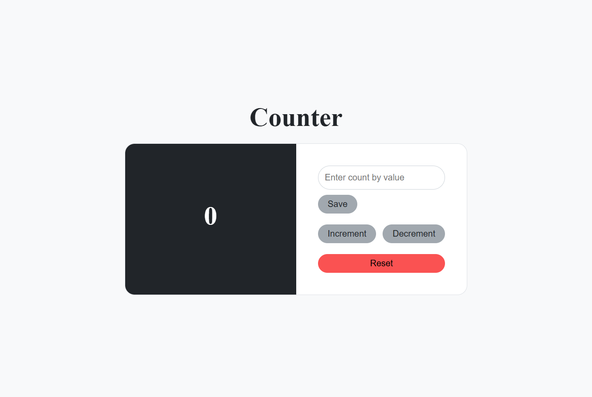

# 🌾 Counter App 

A **React Counter Application** that allows users to increment and decrement a counter by a **custom step value**, with data persistence using **LocalStorage**.  
The counter value and step value are saved even after page refresh.

🔗 **Live Demo:** https://pr-2-counter-wheat.vercel.app/

---

## ✨ Features

✅ Increment counter  
✅ Decrement counter  
✅ Custom "Count By" value (1–20)  
✅ Reset counter and step value  
✅ Data persistence using LocalStorage  
✅ Responsive and simple UI  

---

## 🛠️ Tech Stack

- **React JS**
- **JavaScript (ES6+)**
- **HTML5**
- **CSS3**
- **LocalStorage**
- **Vercel** (Deployment)

---

## 📸 How It Works

- Default increment/decrement value is **1**
- User can set a custom value using the input field
- Counter updates using the saved value
- Data remains saved even after browser refresh
- Reset clears both counter and step value

---

## 📷 Project Screenshot

